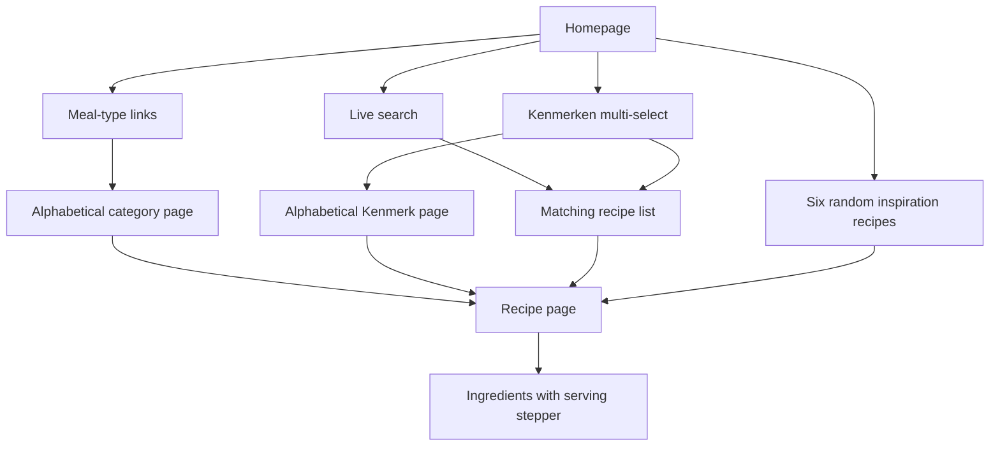
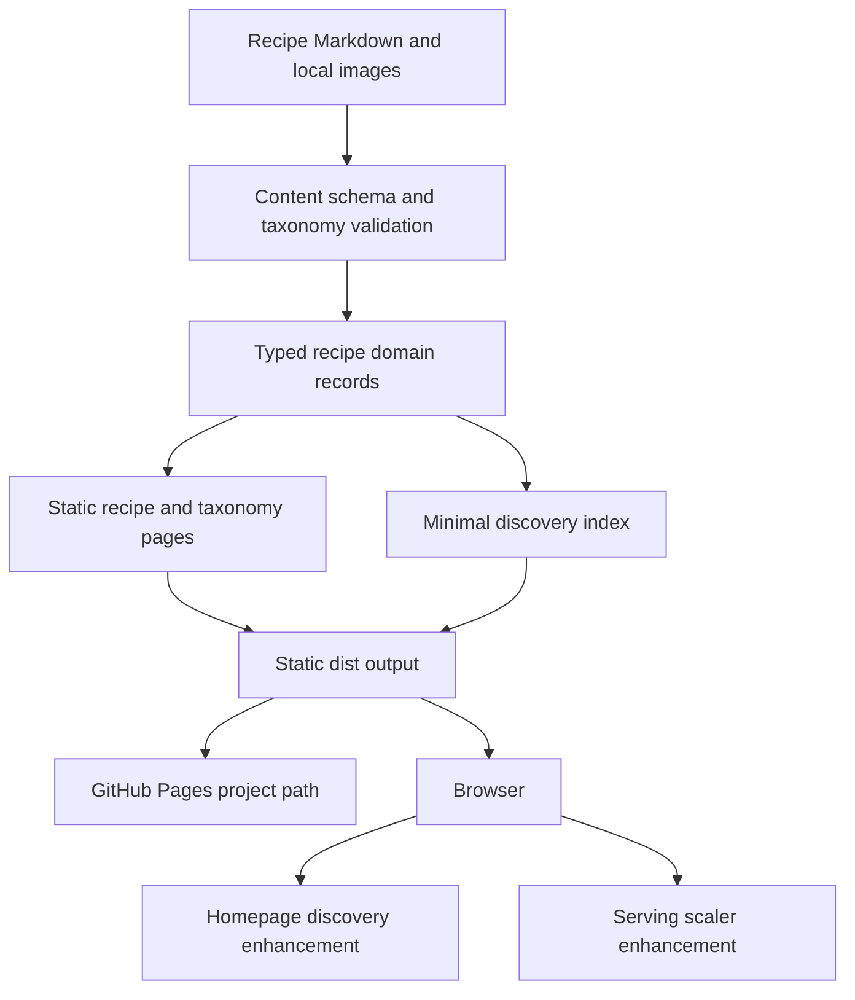
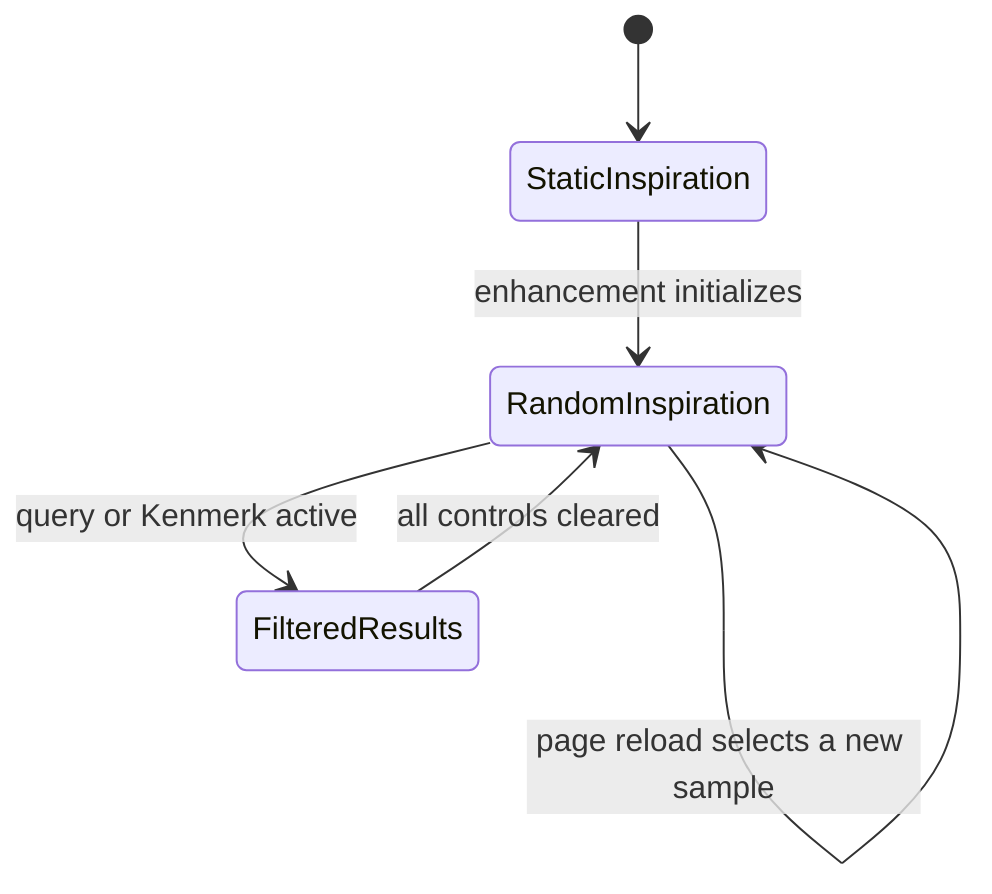
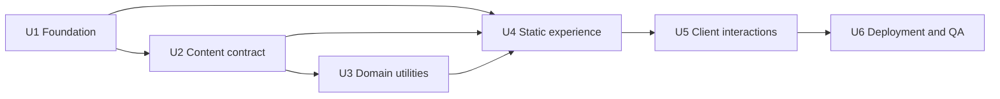

# Family Recipe Site - Plan

## Goal Capsule

- **Objective:** The household can find and use family recipes on a phone anywhere, then scale ingredient quantities without carrying a booklet or calculating amounts manually.
- **Means:** Build a Dutch, mobile-first Astro static site from validated recipe content (KTD1).
- **Product authority:** Product Contract requirements override Planning Contract decisions, which override Implementation Unit details.
- **Open blockers:** None before planning.
- **Execution profile:** Code implementation with local verification and browser evidence.
- **Tail ownership:** LFG owns implementation, review, commit, and any available GitHub shipping tail.

---

## Product Contract

### Summary

Build a compact Dutch family recipe website that is developed locally and published as a static GitHub Pages site.
Recipes remain easy to maintain as separate source files while the generated site provides search, category browsing, randomized inspiration, images, and serving-based ingredient scaling.

### Problem Frame

The household currently stores recipes in a physical booklet.
Taking it while travelling or shopping is inconvenient, and every serving change requires manual ingredient arithmetic.
The collection also needs a maintainable way to grow without introducing a CMS or hosted application backend.

### Actors

- A1. **Household cook:** The user, their wife, or an occasional family member who browses recipes and cooks from a phone or larger screen.
- A2. **Recipe maintainer:** The user, who adds, changes, or removes recipe source files locally and publishes the generated site through GitHub.

### Key Decisions

- **Astro static generation** (session-settled: user-directed — chosen over a custom Node generator and manual HTML: shared generation avoids duplication as the collection grows). Governs R1, R2, R3.
- **Local source-file maintenance** (session-settled: user-directed — chosen over GitHub web editing and an on-site form: only the user needs to maintain recipes). Governs R3, R4.
- **Dutch-only interface** (session-settled: user-directed — chosen over English and bilingual interfaces: Dutch is the household language). Governs R1.
- **Search across titles, descriptions, and ingredients** (session-settled: user-directed — chosen over title-only and full-instruction search: discovery stays useful without incidental instruction matches). Governs R8.
- **All selected Kenmerken must match** (session-settled: user-directed — chosen over matching any selected value: combined filters should narrow to a specific idea). Governs R9.
- **Inline homepage results** (session-settled: user-directed — chosen over persistent parallel results and a dedicated results page: the mobile page stays focused). Governs R10.
- **Stepper serving control from 1 through 12** (session-settled: user-directed — chosen over presets and free numeric input: plus and minus controls are fastest on mobile). Governs R14.
- **Exact scaled quantities** (session-settled: user-directed — chosen over automatic rounding and per-ingredient rounding rules: recipe proportions remain intact). Governs R15, R16.
- **Optional images with a fallback** (session-settled: user-directed — chosen over mandatory images: a missing photograph must not block a recipe). Governs R5, R17.
- **Essential recipe metadata only** (session-settled: user-directed — chosen over provenance and extended nutrition metadata: recipe entry should remain lightweight). Governs R4.
- **Category pages for both taxonomies** (session-settled: user-directed — chosen over meal-type pages alone: meal types and Kenmerken remain equally browsable). Governs R11, R12.
- **Online-only first release** (session-settled: user-directed — chosen over full or recent-recipe offline access: offline behavior is not required for the initial site). Governs R2.
- **Kenmerken terminology** (session-settled: user-directed — chosen over Ingrediënttypes and Tags: the list mixes ingredients, dish formats, and preparation styles). Governs R6, R9, R12.

### Requirements

**Delivery and maintenance**

- R1. The complete user interface and recipe labels must be in Dutch and must render as a modern, restrained, mobile-first experience.
- R2. The published result must be static HTML, CSS, images, and client-side JavaScript that behaves consistently in local development and on GitHub Pages, including deployment below a repository path.
- R3. Astro must generate the site without a CMS, application backend, database, user account, or sign-in flow.
- R4. Each recipe must live in a separate maintainer-editable source file and contain a title, short description, optional image, one meal type, zero or more Kenmerken, total cooking time, ingredients, preparation steps, and optional notes.
- R5. Recipe images must be responsive, must preserve an appetizing crop without distortion, and must fall back to a consistent placeholder when absent.

**Classification**

- R6. Every recipe must have exactly one meal type from `Ontbijt/Lunch`, `Voorgerechten`, `Hoofdgerechten`, `Desserts`, or `Overig`.
- R7. A recipe may have multiple Kenmerken, ordered as `Vlees`, `Vis`, `Kip`, `Vega`, `Pasta`, `Rijst`, `Aardappel`, `Soep`, `Ei`, `Zoet`, and `Ovengerecht`.

**Discovery and browsing**

- R8. The homepage must provide live search across recipe titles, short descriptions, and ingredient names.
- R9. The homepage must provide multi-select Kenmerken filtering where a recipe appears only when it contains every selected Kenmerk.
- R10. Activating search or filtering must replace the random inspiration list with all matching recipes and must provide a clear empty state when nothing matches.
- R11. The homepage must link to the meal-type and Kenmerk category pages.
- R12. Every meal type and every Kenmerk must have a dedicated page listing its recipes alphabetically by Dutch recipe title.
- R13. On each unfiltered homepage load or refresh, the inspiration section must show six distinct randomly selected recipes while excluding recipes whose meal type is `Voorgerechten` or `Desserts`; when fewer than six eligible recipes exist, it must show every eligible recipe without duplication.



**Recipe use and scaling**

- R14. Every recipe page must default to four servings and place a `− / aantal personen / +` selector directly above its ingredient list, limited to whole serving counts from 1 through 12.
- R15. Changing the serving count must immediately multiply each numeric ingredient quantity by the selected serving count divided by four.
- R16. Scaled quantities must use readable fractions or decimals without automatic rounding, while non-numeric quantities such as `naar smaak` remain unchanged.
- R17. Every recipe page must present the recipe image or fallback, classification, description, total cooking time, serving control, ingredient list, ordered preparation steps, and optional notes.

**Responsive interaction**

- R18. Homepage controls, recipe cards, category lists, and recipe pages must remain readable and operable on current phone and desktop widths without horizontal page scrolling.
- R19. Interactive controls must support touch, keyboard use, visible focus, and descriptive accessible labels.

### Key Flows

- F1. **Random inspiration**
  - **Trigger:** A1 opens or refreshes the homepage without active search or filters.
  - **Steps:** The page presents meal-type links, Kenmerken controls, and the eligible random recipe selection.
  - **Outcome:** A1 can open an inspiring recipe without already knowing what to cook.
  - **Covered by:** R11, R13, R18.
- F2. **Live search and filtering**
  - **Trigger:** A1 types a query or selects one or more Kenmerken.
  - **Steps:** The random list is replaced immediately by recipes matching the active query and every selected Kenmerk.
  - **Outcome:** A1 sees one focused result set or a clear empty state.
  - **Covered by:** R8, R9, R10.
- F3. **Category browsing**
  - **Trigger:** A1 follows a meal-type or Kenmerk link.
  - **Steps:** The site opens the corresponding category page and presents matching recipes alphabetically.
  - **Outcome:** A1 can scan a predictable collection and open a recipe.
  - **Covered by:** R11, R12.
- F4. **Cook with scaled ingredients**
  - **Trigger:** A1 opens a recipe and changes the default serving count.
  - **Steps:** The selector stays within 1 through 12 and numeric amounts update immediately while textual amounts remain stable.
  - **Outcome:** A1 can cook for the chosen group size without manual calculation.
  - **Covered by:** R14, R15, R16, R17.
- F5. **Maintain a recipe**
  - **Trigger:** A2 adds, edits, or removes one recipe source file and its optional image.
  - **Steps:** The site generation incorporates the change into recipe pages, search, filters, category pages, and eligible random selections.
  - **Outcome:** The collection stays internally consistent without editing generated pages by hand.
  - **Covered by:** R3, R4, R5, R8, R12, R13.

### Acceptance Examples

- AE1. **Covers R13.** Given at least six eligible recipes plus recipes in `Voorgerechten` and `Desserts`, when the homepage loads without active controls, then it shows six distinct eligible recipes and none from either excluded meal type.
- AE2. **Covers R13.** Given five eligible recipes, when the homepage loads, then all five appear once and the page does not invent or duplicate entries to reach six.
- AE3. **Covers R8, R10.** Given a recipe whose ingredient list contains `kikkererwten` but whose title does not, when A1 types that word, then the random list is replaced by a result set containing that recipe.
- AE4. **Covers R9, R10.** Given selected Kenmerken `Kip` and `Rijst`, when recipes match only one of them, then those recipes are excluded and only recipes carrying both remain.
- AE5. **Covers R12.** Given three recipes in one category with titles beginning with B, A, and C, when its page opens, then they appear in A, B, C order.
- AE6. **Covers R14, R15, R16.** Given a four-serving recipe containing `2 eieren`, `300 g rijst`, and `zout naar smaak`, when A1 selects six servings, then the page shows `3 eieren`, `450 g rijst`, and `zout naar smaak`.
- AE7. **Covers R14, R16.** Given a four-serving recipe containing `1 ei`, when A1 selects six servings, then the page shows an accurate `1,5 ei` quantity and does not round it automatically.
- AE8. **Covers R5, R17.** Given a recipe without an image, when its card or detail page renders, then the consistent fallback appears and the recipe remains fully usable.
- AE9. **Covers R10.** Given a search and filter combination with no matches, when it becomes active, then the random list disappears and a Dutch empty-state message appears.

### Success Criteria

- A household cook can find a recipe, read it, and change its serving count comfortably on a phone without horizontal page scrolling.
- Serving changes from 1 through 12 produce immediate and mathematically correct ingredient quantities while preserving textual amounts.
- Adding or removing one recipe source file updates every derived discovery surface after site generation without hand-editing generated pages.
- The same built site works when served locally and from its configured GitHub Pages repository path.

### Scope Boundaries

**Deferred for later**

- A dedicated search-results page.
- Offline or installable-app behavior.
- Favorites, shopping lists, nutrition data, allergens, cuisine metadata, equipment lists, and recipe provenance.

**Outside this product's identity**

- A CMS, database, application backend, user accounts, or browser-based recipe authoring.
- Mandatory photography as a prerequisite for publishing a recipe.

### Dependencies / Assumptions

- The maintainer supplies family recipe content and photographs; demonstration recipes must not ship alongside the real collection.
- The first release targets current evergreen browsers and assumes an internet connection.
- The site provides no access control; repository and GitHub Pages visibility determine who can reach published family content.
- GitHub Pages hosting and repository setup will be available when deployment work begins.

---

## Planning Contract

### Product Contract Preservation

Product Contract restructured, no scope change: the optional-image Key Decision now cites R17 instead of unrelated random-selection requirement R13.
All R, A, F, and AE identifiers remain stable.

### Key Technical Decisions

- KTD1. **Astro 7 static output on Node 24 with npm.** Use Astro's current static mode, Content Layer, and official GitHub Pages action without a server adapter. This instantiates the settled Astro direction for R1, R2, and R3. (session-settled: user-directed — chosen over a custom Node generator and manual HTML: shared static generation avoids duplicated page maintenance.)
- KTD2. **Validated Markdown recipe collection.** Keep one Markdown file per recipe and validate frontmatter through one strict schema that imports the canonical meal types and Kenmerken. Governs R4, R6, and R7.
- KTD3. **Exact quantity grammar with a pure scaler.** Store scalable quantities as decimal, fraction, or mixed-fraction strings that parse to rational values; store textual amounts separately. Format reduced results as whole numbers, exact Dutch decimals when the denominator terminates in base ten, and reduced mixed fractions otherwise. Governs R14, R15, and R16.
- KTD4. **Static HTML first, small framework-free enhancements second.** Generate browseable pages and four-serving ingredients at build time, then use processed Astro scripts or custom elements for randomization, filtering, and serving changes. Pre-render one shared card node per recipe so the homepage enhancement only reorders and toggles canonical markup rather than duplicating the Astro card contract in browser JavaScript. Governs R8, R9, R10, R13, R14, R18, and R19.
- KTD5. **One base-aware URL boundary.** Centralize internal URL creation and derive production `site` and `base` values from the GitHub repository environment so no route or asset relies on a leading root slash. Governs R2, R11, and R12.
- KTD6. **Astro-managed local images with one shared fallback.** Validate declared local images at build time, optimize them through Astro assets, and render a decorative fallback only when the image field is absent. Governs R5 and R17.
- KTD7. **Pure-function tests plus real-browser acceptance coverage.** Use Vitest for schemas and domain utilities, Astro checks/builds for content and route integration, and Playwright for mobile interaction and project-path navigation. Governs R8 through R19.

### Assumptions

These are unvalidated planning bets created by the non-interactive pipeline and remain subordinate to the Product Contract.

- A usable no-JavaScript baseline shows navigation, category links, a deterministic inspiration subset, recipe content, and four-serving ingredients; JavaScript adds live search, filtering, per-load reshuffling, and scaling.
- One random inspiration sample is chosen during page initialization and restored when search and filters are cleared; only a fresh page load or refresh chooses a new sample.
- Multi-word search requires every normalized query term and every selected Kenmerk to match, while whitespace-only search is inactive.
- Recipe filenames provide stable recipe IDs and URL slugs; title edits do not change URLs, and collisions fail the build.
- Invalid recipe data and declared-but-missing images fail the build with file and field context; an omitted image uses the fallback.
- Every defined meal type and Kenmerk gets a page even when it has no recipes, with a concise Dutch empty state.
- Search, selected Kenmerken, and serving counts are ephemeral and are not persisted in URLs or browser storage.
- Only family recipes ship in the content collection; isolated test fixtures verify larger inspiration samples and excluded meal types.
- The initial GitHub repository is expected to be a project site rather than the special account-root Pages repository; deployment configuration remains environment-driven so the repository name is not hard-coded.

### High-Level Technical Design

The build path keeps recipe authority in source content and emits every durable navigation surface before browser enhancement runs.



The homepage enhancement owns one page-load sample and switches between inspiration and filtered-result states without changing the static navigation baseline.



### Implementation Constraints

- Use a supported even Node release that satisfies Astro 7; standardize Node 24 for local and CI execution.
- Keep Astro output static and avoid framework integrations or server adapters unless implementation evidence invalidates the simpler path.
- Keep browser payloads limited to card metadata and normalized search fields rather than serialized recipe bodies.
- Use Dutch locale handling for display numbers and alphabetical sorting.
- Use native buttons and semantic output for the serving stepper, with disabled boundaries and at least WCAG 2.2 minimum target sizing.
- Treat every generated link, image URL, and navigation assertion as GitHub Pages base-path sensitive.

### Sequencing



### Risks & Dependencies

- **Repository identity is not configured yet.** Keep Pages `site` and `base` environment-driven and prove a simulated `/site-recepten/` prefix locally.
- **Astro 7 is current and still moving.** Commit one lockfile and let automated checks expose future incompatible upgrades.
- **Static randomization needs JavaScript.** Pre-render a usable subset so delayed or failed enhancement never leaves an empty page.
- **Quantity parsing can corrupt recipe proportions.** Keep parsing and scaling pure, reject malformed input, and cover fractions and boundary servings before wiring the UI.
- **User-supplied photographs may vary widely.** Reserve one aspect ratio and let Astro generate responsive candidates without distorting source imagery.

### Sources / Research

- [Astro installation and Node support](https://docs.astro.build/en/install-and-setup/)
- [Astro content collections](https://docs.astro.build/en/guides/content-collections/)
- [Astro client-side scripts](https://docs.astro.build/en/guides/client-side-scripts/)
- [Astro assets](https://docs.astro.build/en/reference/modules/astro-assets/)
- [Astro deployment to GitHub Pages](https://docs.astro.build/en/guides/deploy/github/)
- [GitHub Pages custom workflows](https://docs.github.com/en/pages/getting-started-with-github-pages/using-custom-workflows-with-github-pages)
- [WAI spinbutton guidance](https://www.w3.org/WAI/ARIA/apg/patterns/spinbutton/)
- [Playwright locator guidance](https://playwright.dev/docs/locators)

### Output Structure

```text
.
├── .github/workflows/deploy.yml
├── .gitignore
├── .nvmrc
├── README.md
├── astro.config.mjs
├── package.json
├── package-lock.json
├── playwright.config.ts
├── tsconfig.json
├── vitest.config.ts
├── public/
│   └── favicon.svg
├── src/
│   ├── assets/recipes/
│   ├── components/
│   │   ├── EmptyState.astro
│   │   ├── RecipeCard.astro
│   │   ├── RecipeDiscovery.astro
│   │   ├── RecipeImage.astro
│   │   └── ServingScaler.astro
│   ├── data/
│   │   ├── recipes/
│   │   └── taxonomies.ts
│   ├── layouts/BaseLayout.astro
│   ├── lib/
│   │   ├── quantities.ts
│   │   ├── random.ts
│   │   ├── recipes.ts
│   │   ├── search.ts
│   │   ├── sort.ts
│   │   └── urls.ts
│   ├── pages/
│   │   ├── index.astro
│   │   ├── kenmerken/[slug].astro
│   │   ├── maaltijdtypes/[slug].astro
│   │   └── recepten/[id].astro
│   ├── styles/global.css
│   ├── content.config.ts
│   └── env.d.ts
└── tests/
    ├── e2e/
    └── unit/
```

---

## Implementation Units

### U1. Bootstrap the static project foundation

- **Goal:** Establish the Astro toolchain, project-path configuration, and repeatable quality commands before feature code lands.
- **Requirements:** R1, R2, R3, R18, R19.
- **Dependencies:** None.
- **Files:** `package.json`, `package-lock.json`, `.nvmrc`, `.gitignore`, `astro.config.mjs`, `tsconfig.json`, `vitest.config.ts`, `playwright.config.ts`, `src/env.d.ts`, `src/pages/index.astro`, `public/favicon.svg`, `tests/e2e/base-path.spec.ts`.
- **Approach:**
  1. Pin current Astro 7 and a Node 24-compatible npm toolchain.
  2. Keep static output and read local or CI site/base values through one configuration boundary per KTD1 and KTD5.
  3. Define scripts for development, type/content checking, unit tests, build, browser tests, and aggregate validation.
  4. Create a minimal homepage and favicon scaffold, then configure Playwright to build and preview with a simulated GitHub project prefix before U4 refines those assets.
- **Execution note:** This unit is mostly packaging and configuration; establish install and build smoke proof before adding application behavior.
- **Patterns to follow:** Official Astro installation, configuration, and GitHub Pages guidance cited in Planning Contract.
- **Test scenarios:**
  - A clean npm install on Node 24 resolves exactly the committed lockfile.
  - A default local build emits static output without a server adapter.
  - A production-like build under `/site-recepten/` serves the shell and favicon below that prefix.
- **Verification:** Local development starts, both root and simulated-prefix builds complete, and the base-path smoke test can navigate the generated shell.

### U2. Define validated recipe content

- **Goal:** Create the strict recipe and taxonomy contract, exact quantity representation, optional-image behavior, and representative content needed by every page.
- **Requirements:** R4, R5, R6, R7, R14, R15, R16, R17; F5; AE6, AE7, AE8.
- **Dependencies:** U1.
- **Files:** `src/content.config.ts`, `src/data/taxonomies.ts`, `src/data/recipes/*.md`, `src/assets/recipes/*`, `src/lib/quantities.ts`, `tests/unit/quantities.test.ts`, `tests/unit/content-contract.test.ts`.
- **Approach:**
  1. Define canonical labels and stable slugs for each meal type and Kenmerk.
  2. Validate one meal type, unique known Kenmerken, four base servings, positive times, nonempty ingredients, and nonempty preparation steps per KTD2.
  3. Give each ingredient either a parseable scalable quantity or a fixed Dutch amount, never both, per KTD3.
  4. Validate an optional local image and its alt text while leaving absent images valid per KTD6.
  5. Add the initial family recipe and keep broader page-state coverage in isolated test fixtures.
- **Technical design:** Directional quantity grammar: `decimal | fraction | mixed-fraction`; normalize to a reduced rational before multiplying by `selected servings / 4`. Emit denominator-one results as whole numbers, terminating values with a Dutch decimal comma, and all other values as reduced proper or mixed fractions.
- **Patterns to follow:** Astro Content Layer with a local glob loader and schema validation.
- **Test scenarios:**
  - A complete recipe with a local image and multiple Kenmerken validates.
  - A recipe without an image validates and retains fallback eligibility.
  - Unknown meal types, unknown Kenmerken, duplicate Kenmerken, duplicate IDs, empty ingredients, and empty steps fail validation.
  - A numeric quantity and a fixed text amount on the same ingredient fail validation.
  - Decimal, fraction, and mixed-fraction values parse to reduced rational quantities.
  - One third scaled from four to five servings renders exactly as `5/12`, while terminating results use Dutch decimal commas.
  - Malformed, zero, and negative quantities fail with actionable field context.
  - Covers AE6 and AE7. Scaling six servings from a four-serving base preserves exact arithmetic and Dutch decimal output.
- **Verification:** Astro content checks and the unit suite accept all family recipes and reject every invalid fixture.

### U3. Build pure discovery and URL utilities

- **Goal:** Provide deterministic, independently testable selection, search, sorting, taxonomy, and base-path behavior for pages and enhancements.
- **Requirements:** R8, R9, R10, R11, R12, R13; F1, F2, F3; AE1, AE2, AE3, AE4, AE5, AE9.
- **Dependencies:** U1, U2.
- **Files:** `src/lib/random.ts`, `src/lib/recipes.ts`, `src/lib/search.ts`, `src/lib/sort.ts`, `src/lib/urls.ts`, `tests/unit/random.test.ts`, `tests/unit/search.test.ts`, `tests/unit/sort.test.ts`, `tests/unit/urls.test.ts`.
- **Approach:**
  1. Build minimal card and search records from validated recipes without serializing preparation bodies.
  2. Normalize Dutch text once, split nonblank queries into terms, and intersect search terms with selected Kenmerken.
  3. Sort titles through one Dutch collator with recipe ID as a stable tie-breaker.
  4. Sample eligible recipes without replacement through an injectable seeded generator, while production seeds come from browser crypto.
  5. Route every internal href through the base-aware boundary from KTD5.
- **Patterns to follow:** Pure TypeScript functions with no DOM dependency; deterministic inputs in tests.
- **Test scenarios:**
  - Covers AE1 and AE2. Selection excludes `Voorgerechten` and `Desserts`, returns no duplicates, and caps at the eligible count.
  - A fixed seed always returns the same ordered sample while different seeds can return different valid samples.
  - Covers AE3. Search finds ingredient-only text and ignores case and composed/decomposed accents.
  - Covers AE4. Every query term and every selected Kenmerk must match.
  - Blank or whitespace-only queries are inactive.
  - Covers AE5. Dutch titles sort predictably with numeric fragments and stable ties.
  - Root and `/site-recepten/` configurations generate correct recipe and taxonomy links without doubled or missing slashes.
- **Verification:** All domain utilities pass unit tests without starting Astro or a browser.

### U4. Generate the static responsive experience

- **Goal:** Render the homepage baseline, recipe pages, and both taxonomy page families as a restrained responsive site that remains browseable before enhancement.
- **Requirements:** R1, R4, R5, R10, R11, R12, R13, R17, R18, R19; F1, F3; AE2, AE5, AE8, AE9.
- **Dependencies:** U1, U2, U3.
- **Files:** `src/layouts/BaseLayout.astro`, `src/components/RecipeCard.astro`, `src/components/RecipeImage.astro`, `src/components/EmptyState.astro`, `src/pages/index.astro`, `src/pages/recepten/[id].astro`, `src/pages/maaltijdtypes/[slug].astro`, `src/pages/kenmerken/[slug].astro`, `src/styles/global.css`, `public/favicon.svg`, `tests/e2e/static-browse.spec.ts`.
- **Approach:**
  1. Establish a small neutral visual system with strong hierarchy, compact cards, accessible focus, and touch-sized controls.
  2. Order the homepage as title and context, search, meal-type links, Kenmerken, result status, then cards so discovery remains above the first card on phones.
  3. Render one deterministic eligible inspiration subset in the homepage HTML and all defined taxonomy links.
  4. Generate recipe and taxonomy routes at build time from validated records and canonical slug maps.
  5. Render optimized responsive images or the shared decorative fallback per KTD6.
  6. Use one content column with wrapping controls below `48rem`, two card columns from `48rem`, and a capped recipe reading width.
  7. Generate empty taxonomy pages with a Dutch empty state rather than dropping their links.
- **Patterns to follow:** Server-rendered Astro components, semantic landmarks, CSS custom properties, and no client framework.
- **Test scenarios:**
  - JavaScript-disabled navigation reaches the homepage, every taxonomy namespace, and a recipe detail page under the configured base.
  - Covers AE2. Fewer than six eligible recipes render once each in the static inspiration section.
  - Covers AE5. Category cards follow Dutch alphabetical order.
  - Covers AE8. Present images expose useful alt text and missing images render the fallback without a broken image element.
  - Covers AE9. Empty taxonomy pages and no-result shells use concise Dutch messages.
  - Phone and desktop viewports show no horizontal page scrolling and preserve visible keyboard focus.
  - Responsive browser checks cover `360px`, `768px`, and `1280px` widths.
- **Verification:** A production build emits every expected static route and browser smoke checks prove no-JavaScript browse/read behavior at mobile and desktop widths.

### U5. Add live discovery and serving controls

- **Goal:** Enhance the static pages with per-load inspiration, live search, AND filtering, and the settled serving stepper without weakening the baseline.
- **Requirements:** R8, R9, R10, R13, R14, R15, R16, R18, R19; F1, F2, F4; AE1, AE3, AE4, AE6, AE7, AE9.
- **Dependencies:** U2, U3, U4.
- **Files:** `src/components/RecipeDiscovery.astro`, `src/components/ServingScaler.astro`, `src/pages/index.astro`, `src/pages/recepten/[id].astro`, `src/styles/global.css`, `tests/e2e/discovery.spec.ts`, `tests/e2e/serving-scaler.spec.ts`.
- **Approach:**
  1. Pre-render one shared card node per recipe, expose only minimal normalized discovery fields through data attributes, and enhance the server-rendered inspiration region once per page load by reordering and toggling those nodes.
  2. Preserve the page-load sample while controls are active and restore it when all controls clear.
  3. Render Kenmerken as native checkboxes styled as wrapping filter chips inside a labelled fieldset, with checked and focus-visible states and a Dutch clear-all control whenever any query or Kenmerk is active.
  4. Update results through one batched DOM render and expose a Dutch result count or empty state.
  5. Implement native decrement and increment buttons around an announced count, disable them at 1 and 12, and scale only numeric ingredients through the pure quantity utility.
  6. Remove or hide inert enhancement controls until their scripts initialize.
- **Patterns to follow:** Astro processed scripts or custom elements with native buttons, data attributes, and minimal client state.
- **Test scenarios:**
  - Covers AE1. A fixed test seed renders six distinct eligible recipes and excludes both blocked meal types.
  - Reload initialization can choose a new sample while clearing controls restores the current sample.
  - Covers AE3 and AE4. Search and multiple Kenmerken combine by intersection and replace inspiration immediately.
  - Covers AE9. No matches replace the cards with the Dutch empty state.
  - Covers AE6. Six servings show `3 eieren`, `450 g rijst`, and unchanged `zout naar smaak`.
  - Covers AE7. Six servings from one base egg display `1,5 ei` without whole-item rounding.
  - The minus button is disabled at one, the plus button is disabled at twelve, and the count resets to four on a fresh navigation.
  - Tab and activation keys operate every control by accessible Dutch name and meaningful changes are announced politely.
- **Verification:** Unit-backed calculations and Playwright interaction flows pass at mobile and desktop viewports without console errors or content flashes that leave an empty experience.

### U6. Add deployment, contributor guidance, and release QA

- **Goal:** Make clean installation, recipe maintenance, GitHub Pages deployment, and full release verification repeatable.
- **Requirements:** R2, R3, R4, R5, R18, R19; F5; all Success Criteria.
- **Dependencies:** U1, U2, U3, U4, U5.
- **Files:** `.github/workflows/deploy.yml`, `README.md`, `playwright.config.ts`, `tests/e2e/base-path.spec.ts`, `tests/e2e/static-browse.spec.ts`, `tests/e2e/discovery.spec.ts`, `tests/e2e/serving-scaler.spec.ts`.
- **Approach:**
  1. Add the official GitHub Pages build and deploy jobs with scoped permissions, one lockfile, and environment-derived site/base values.
  2. Document Node setup, local scripts, the recipe schema, image conventions, taxonomy extension, and GitHub Pages source configuration.
  3. Run the complete test matrix against a production build under the simulated repository prefix.
  4. Verify direct navigation and refresh on homepage, recipe, meal-type, and Kenmerk routes.
- **Execution note:** Treat the deployment workflow and production-prefix browser run as the release smoke proof.
- **Patterns to follow:** Astro's `withastro/action` workflow followed by GitHub's `deploy-pages` action.
- **Test scenarios:**
  - A clean checkout can install, validate content, run unit tests, build, and run browser tests through documented commands.
  - Every internal link and local image remains below `/site-recepten/` during the production-prefix run.
  - Direct navigation and refresh succeed for one route in each generated namespace.
  - Editing, adding, and removing a family recipe changes the generated detail, search, category, and inspiration surfaces after rebuild.
  - The workflow declares only the permissions required to read contents, write Pages, and request an identity token.
- **Verification:** The aggregate validation command passes, the workflow matches official Pages requirements, and the README lets a new maintainer add one recipe without editing generated HTML.

---

## Verification Contract

| Gate | Command or evidence | Applies to | Pass signal |
|---|---|---|---|
| Clean install | `npm ci` | U1-U6 | Lockfile installs on Node 24 without mutation. |
| Static and content analysis | `npm run check` | U1, U2, U4, U5 | Astro and TypeScript report no diagnostics. |
| Domain behavior | `npm run test:unit` | U2, U3 | Quantity, search, sort, selection, and URL suites pass. |
| Static integration | `npm run build` | U1, U2, U4, U6 | Every content entry and generated route builds in static mode. |
| Browser acceptance | `npm run test:e2e` | U1, U4, U5, U6 | Mobile, desktop, no-JavaScript, interaction, and project-prefix scenarios pass. |
| Full local gate | `npm run validate` | U1-U6 | Check, unit, build, and browser gates complete in one documented workflow. |
| Browser skill evidence | `ce-test-browser mode:pipeline` | R8-R19 | A real browser confirms the affected flows with no unresolved critical failure. |

`release:validate` is not applicable because this greenfield repository defines `npm run validate` as its release-quality aggregate.

---

## Definition of Done

- The unified artifact remains `artifact_readiness: implementation-ready` and the Product Contract meaning and IDs remain intact.
- U1-U6 are implemented in dependency order or with equivalent dependency-safe sequencing.
- Every requirement R1-R19 is implemented and covered by its traced unit verification.
- Every acceptance example AE1-AE9 has automated unit, build, or browser evidence.
- The site remains readable without JavaScript and gains the specified live behaviors after enhancement initializes.
- The root build and a simulated `/site-recepten/` build contain no broken internal route or local image reference.
- Mobile and desktop browser checks show no horizontal page scrolling, unreachable control, missing focus indicator, or serving-bound violation.
- Clean install, Astro checks, unit tests, static build, Playwright tests, and `npm run validate` pass.
- The GitHub Pages workflow is syntactically valid and uses the official build/upload/deploy flow.
- `README.md` documents local development, recipe maintenance, images, taxonomies, validation, and Pages setup.
- Generated or experimental code from abandoned approaches is removed from the final diff.
